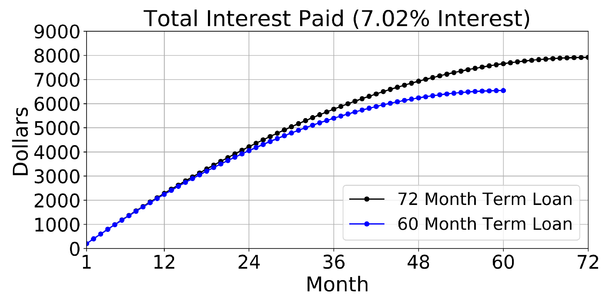
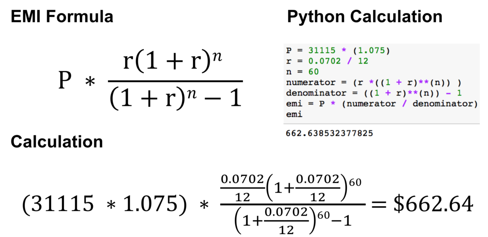
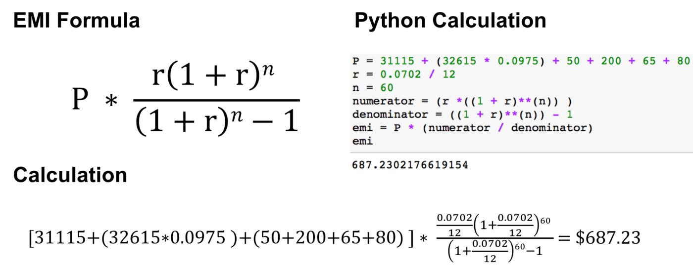
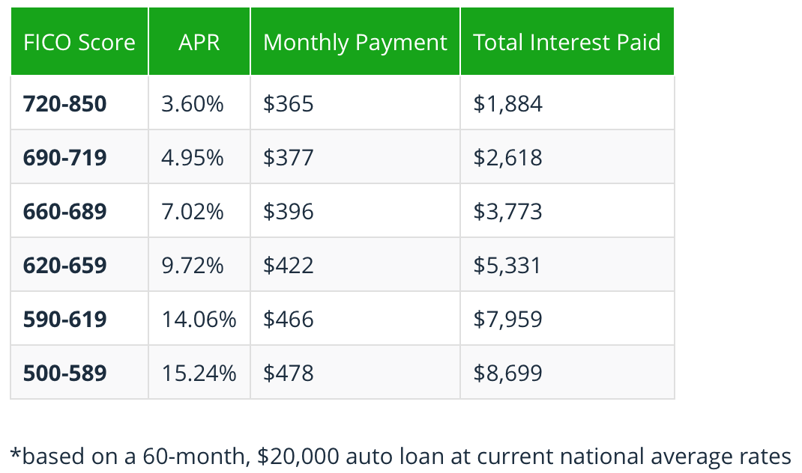
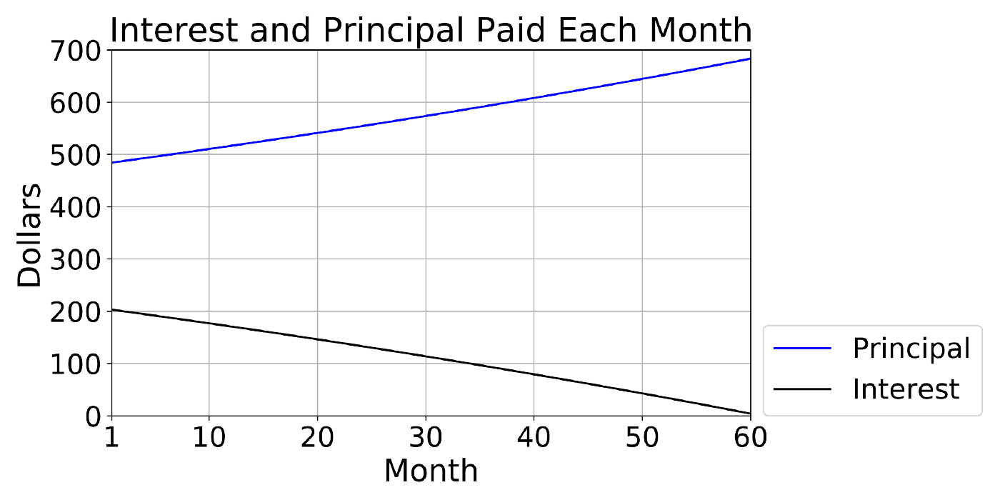
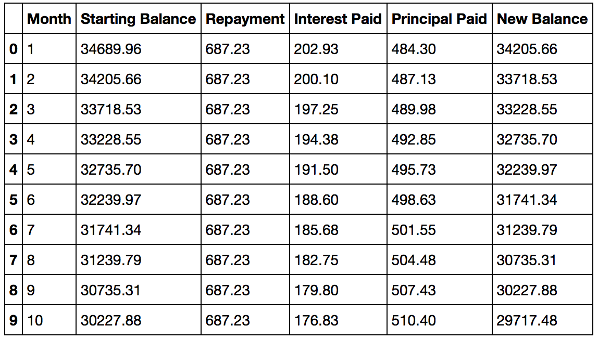
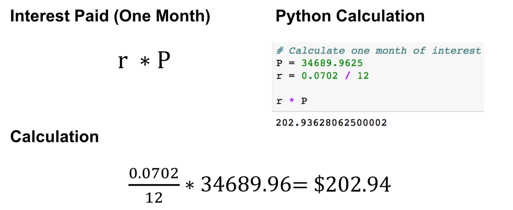
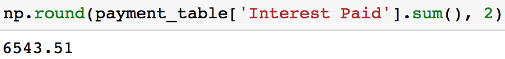

# Chi phí cho vay mượn một chiếc ôtô

Tìm hiểu về cách tính các khoản thanh toán ô tô hàng tháng (khoản trả hàng tháng). Tìm hiểu cách lãi suất/APR ảnh hưởng đến các khoản thanh toán hàng tháng và thời hạn của khoản vay ảnh hưởng như thế nào đến tổng số tiền lãi phải trả.



Bài viết này bao gồm:
- Cách tính các khoản thanh toán hàng tháng (khoản trả hàng tháng).
- Cách lãi suất/APR ảnh hưởng đến các khoản thanh toán đó.
- Cách thời hạn vay ảnh hưởng đến tổng số tiền lãi phải trả.

## Cách tính các khoản thanh toán hàng tháng (khoản trả hàng tháng)

Khoản thanh toán hàng tháng, còn gọi là khoản trả hàng tháng (Equated Monthly Installment - EMI) được định nghĩa bởi [Investopedia](https://en.wikipedia.org/wiki/Investopedia) là số tiền thanh toán cố định được thực hiện bởi người đi vay với người cho vay vào một ngày được chỉ định trước mỗi tháng theo lịch trả nợ. Các khoản trả hàng tháng bao gồm số tiền lãi và tiền gốc mỗi tháng để trong một khoảng thời gian nhất định khoản vay sẽ được trả hết. 


Các khoản trả hàng tháng có thể được tính theo công thức EMI trông giống như bên dưới.


### Ví dụ: Tính khoản trả hàng tháng (đơn giản)


Khi bạn muốn mua chiếc Toyota phiên bản 2019 với giá $31,115. Bạn thắc mắc không biết phải trả bao nhiêu mỗi tháng nếu bạn quyết định vay một khoản tiền để mua chiếc xe mới này. Một đại lý xe hơi đề xuất với mức lãi suất cố định 7,02% trong kỳ hạn 60 tháng. Như vậy khoản trả hàng tháng là bao nhiêu giả sử thuế bán hàng là 7.5% ?



Mặc dù đây là một phép tính đơn giản và tương đối chính xác (ngoại trừ thuế bán hàng là một giả định), có một phép tính chính xác hơn trong ví dụ tiếp theo.

### Ví dụ: Tính khoản trả hàng tháng (với vài khoản phí đi kèm)

Giả sử bạn muốn chiếc Toyota 2019 với giá $31,115 từ một đại lý xe hơi ở LA, nơi thu thuế bán hàng là 9.75%. Giá gốc là $32,615 trước khi đại lý xe hơi giảm 1500 đô. Bạn thắc mắc số tiền phải trả mỗi tháng nếu bạn quyết định vay để mua chiếc xe mới. Đại lý đề xuất mức lãi suất cố định 7.02% trong kỳ hạn 60 tháng. Vậy lần này khoản trả hàng tháng là bao nhiêu ?

Nó có thể giải quyết cùng một cách với ví dụ trên, ngoại trừ việc số tiền gốc của khoản vay phức tạp hơn. Nói cách khác, thuế và phí cần phải được thêm vào giá mua, bởi vì hầu hết các tiểu bang đánh thuế mua xe trước khi các khoản giảm giá hoặc ưu đãi được áp dụng cho giá xe. Mặc dù các khoản phí có thể thay đổi tùy theo từng nơi, nhưng trong ví dụ này có các khoản phí sau:

Phí kiểm tra khí thải: `$50`

Phí đăng ký: `$200`

Phí chuyển đổi đĩa: `$65`

Phí tài liệu của California: `$80`



Khoản trả hàng tháng này cao hơn $24.59 `687.23-662.64` với ví dụ trước đó.

## Cách lãi suất/APR ảnh hưởng đến khoản trả hàng tháng

Trước khi đi sâu vào phần này, bạn cần biết một ít về thuật ngữ **Annual Percentage Rate (APR)** - Lãi suất phần trăm. Đối với các khoản vay mua xe, APR là tỉ lệ lãi phải trả cho khoản vay hàng năm. Lãi suất phần trăm hàng năm thể hiện chi phí vay vốn thực sự phải trả hàng năm. Nó bao gồm tất cả các loại phí liên quan đến giao dịch nhưng không tính gộp. Vì nó bao gồm các loại phí khác nên nó thường cao hơn lãi suất của bạn, tuy vậy về mặt toán học chúng giống nhau ở chỗ cả hai đều cung cấp cùng một khoản thánh toán. Ở đây để đơn giản ta sẽ giả sử APR và lãi suất là như nhau:

Như bảng dưới đây, rõ ràng là điểm FICO của bạn ảnh hưởng đến APR của bạn, điều này ảnh hưởng đến các khoản thanh toán hàng tháng của bạn.



Nếu bạn thắc mắc làm cách nào mà The Simple Dollar có thể tính được Tổng số tiền lãi phải trả, hãy đọc phần tiếp theo. Nó đi vào chi tiết về số tiền lãi bạn phải trả mỗi tháng.

### Tính tổng tiền lãi phải trả

Điều quan trọng ở việc vay tiền là bạn sẽ phải trả bao nhiêu lãi trong suốt thười gian vay. Điều này hơi phức tạp vì tỷ lệ phần trăm của khoản thanh toán hàng tháng (EMI) để trả hết nợ gốc của một khoản vay sẽ tăng lên theo thời gian. 

Sử dụng số tiền gốc là ($34689.96) và lãi suất (7.02%) từ ví dụ ở phần trước, đồ thị bên dưới cho thấy với mỗi lần thanh toán hàng tháng tiếp theo, số tiền gốc được trả tiếp tục tăng trong khi tiền lãi trả tiếp tục được giảm xuống.



Bây giờ tính tổng tiền lãi bằng cách tạo một bảng giống như bên dưới, sau đó cộng tất cả cột Interest Paid.



Bây giờ ta sẽ triển khai sang Python:
1. Việc đầu tiên là tính xem số tiền phải trả hàng tháng sẽ được trả về lãi suất trong một tháng.



2. Mỗi tháng, một số khoản trả hàng tháng được trả cho tiền gốc và một phần trả cho lãi suất. Khi tiền gốc giảm dần, để tính lãi suất bạn phải trả trong những tháng tiếp theo, trước tiên bạn cần phải tính số tiền gốc mới của mình. Bạn có thể xem cách tính điều này dưới đây.


3. Lặp lại bước 1 và 2 cho đến khi giá trị gốc đạt 0. Bạn có thể xem ví dụ về điều này trong đoạn code Python bên dưới.

```python
import numpy as np
import pandas as pd
term = 60
P = 34689.96
def calc_interest(P, emi, interest_rate = 0.0702):
    interest_paid = np.floor(((interest_rate/12)*P)*100)
    principal_paid = np.round(emi-interest_paid, 2)
    new_balance = np.round(P - principal_paid, 2)
    return (emi, interest_paid, principal_paid, new_balance)


payment_list = []

for n in range(1, term + 1):
    emi, i_paid, p_paid, new_p = calc_interest(P, emi)
    payment_list.append([n, P,emi, i_paid, p_paid, new_p])
    p = np.round(new_p, 2)

c_names = ['Month', 'Starting Balance', 'Repayment', 'Interest Paid', 'Principal Paid', 'New Balance']
payment_table = pd.DateFrame(payment_list, columns=c_names)
```


4. Sau khi lấy được tiền lãi được trả cho mỗi tháng, hãy cộng tổng vào cột Interest Paid.

```python
np.round(payment_table['Interest Paid'].sum(),2)
```



### Tái cấp vốn với lãi suất thấp hơn

Ví dụ này xem xét một người có thể trả ít hơn bao nhiêu tiền lãi (Tổng số tiền lãi đã trả) trong quá trình vay với lãi suất thấp hơn. Đặc biệt, chênh lệch giữa lãi suất 3,59% so với lãi suất 7,02% trên kỳ hạn 60 tháng.

```python
P = 34689.96
term = 60

def generate_loan_table(P, term, interest_rate=0.0702):

    def calc_emi(P, n, interest_rate):
        r = interest_rate / 12
        numerator = (r *((1 + r)**(n)) )
        denominator = ((1 + r)**(n)) - 1
        emi = P * (numerator / denominator)
        emi = np.round(emi, 2)
        return(emi)
    
    def calc_interest(P, emi, interest_rate):
        i_paid = np.floor(((interest_rate/12)*P)*100)/100
        p_paid = np.round(emi - i_paid, 2)
        new_p = np.round(P - p_paid,2)
        return(emi, i_paid, p_paid, new_p)

    emi = calc_emi(P, term, interest_rate)
    payment_list = []
    
    for n in range(1, term + 1):
        emi,i_paid,p_paid, new_p = calc_interest(P, emi, interest_rate)
        payment_list.append([n, P,emi, i_paid, p_paid, new_p])
        P = np.round(new_p,2)
   
    payment_table = pd.DataFrame(payment_list, columns = ['Month', 'Starting Balance', 'Repayment', 'Interest Paid', 'Principal Paid', 'New Balance'])

    return(payment_table, np.round(payment_table['Interest Paid'].sum(), 2), emi)
```

Bằng cách sử dụng cùng một phương pháp tính toán như phần trước, mức lãi suất thấp hơn sẽ tiết kiệm được $3285,63 `(6543,51 - 3257,88)` trong tổng số tiền lãi phải trả. Ngoài ra, khoản thanh toán hàng tháng sẽ ít hơn $54,76 `(687,23 - 632,47)` với lãi suất thấp hơn.


Nếu bạn có tùy chọn tái cấp vốn với lãi suất thấp hơn, điều quan trọng cần lưu ý là khoản vay hiện tại của bạn có thể bị phạt khi trả trước hoặc khoản vay mới của bạn có thể có phí gốc. Nói cách khác, hãy cố gắng hết sức để biết những gì bạn đang đăng ký nếu bạn quyết định tái cấp vốn. Tôi nên lưu ý rằng Credit Karma có hướng dẫn về việc tái cấp vốn cho khoản vay mua ô tô của bạn và NerdWallet có một số cách để tránh trả quá nhiều khoản vay mua ô tô của bạn.

## Cách thời hạn vay ảnh hưởng đến tổng lãi phải trả 

Nhìn chung, với cùng một mức lãi suất, thời gian vay của bạn càng dài thì tổng tiền lãi càng nhiều. So sánh hai khoản vay dưới đây. Cả hai đều có lãi suất là 7,02%, nhưng một có kỳ hạn 60 tháng và một có kỳ hạn 72 tháng. Trong khi khoản vay 72 tháng có khoản thanh toán hàng tháng (EMI) thấp hơn khoản vay 60 tháng (591,76 so với 687,23), khoản vay sẽ tính phí cao hơn trong tổng số tiền lãi phải trả.


Đồ thị trên cho thấy khoản vay 72 tháng có tổng tiền lãi là 7916,58 đô la trong khi khoản vay 60 tháng có giá 6543,51 đô la (khoản vay 72 tháng tốn thêm 1373,07 đô la). Nếu bạn muốn tìm hiểu thêm về quyết định vay mua ô tô trong bao lâu thì [Edmunds có một bài viết rất hay về vấn đề này](https://www.edmunds.com/car-loan/how-long-should-my-car-loan-be.html).

# Nguồn

[towardscience](https://towardsdatascience.com/the-cost-of-financing-a-new-car-car-loans-c00997f1aee)